# Azure Current Architecture Map

**Generated:** 2026-06-16  
**Subscription:** Azure subscription 1 (`183863c0-4aaf-4329-ba95-0db3760357f2`)  
**Tenant:** Default Directory (`traceypaegisalign.onmicrosoft.com`)  
**Purpose:** Current Azure estate map for AEGIS infrastructure, startup-credit evidence, and architecture planning.

## Summary

The current Azure environment contains 43 resources across 9 resource groups. The architecture is centered on three active Linux VMs: the AEGIS CyberPeer T4 GPU VM, the CyberPeer Core VM, and the newly provisioned AEGIS Git Forge VM. These are supported by Azure Machine Learning workspaces, Azure AI Services, storage accounts, key vaults, monitoring resources, a container registry, backup services, public IPs, VNets, NICs, NSGs, and network watchers.

For Microsoft for Startups workload evidence, the environment currently demonstrates active use of at least seven service categories: Compute/Virtual Machines, Machine Learning Services, Storage, Container Registry, Network, Recovery Services/Backup, and Key Vault. Azure AI/Cognitive Services and monitoring resources are also provisioned.

## Architecture Diagram

```mermaid
graph TB
    USER["Tracey / AEGIS Operators<br/>Azure CLI, SSH, Browser"]
    DNS["Future DNS<br/>git.digitalmindtripai.com"]

    subgraph "rg-aegis-git / eastus"
        GITPIP["Public IP<br/>aegis-git-forgePublicIP<br/>20.172.153.141<br/>DNS: aegis-git-forge.eastus.cloudapp.azure.com"]
        GITNSG["NSG<br/>aegis-git-forgeNSG<br/>Inbound: 22, 443, 3000"]
        GITVNET["VNet<br/>aegis-git-forgeVNET"]
        GITSUB["Subnet<br/>aegis-git-forgeSubnet"]
        GITNIC["NIC<br/>aegis-git-forgeVMNic<br/>Private IP: 10.0.0.4"]
        GITVM["VM<br/>aegis-git-forge<br/>Standard_D2s_v7<br/>Ubuntu 22.04 LTS<br/>Role: Forgejo / AEGIS Git Guardian"]
        GITDISK["Managed OS Disk<br/>Premium_LRS<br/>30 GB<br/>Detach on delete"]
    end

    subgraph "AEGISCyberPeer_group / eastus"
        T4PIP["Public IP<br/>AEGISCyberPeer-ip<br/>20.115.97.102"]
        T4NSG["NSG<br/>AEGISCyberPeer-nsg<br/>Inbound: 22, 11434, 8000<br/>11434/8000 scoped to 104.28.152.113/32"]
        T4VNET["VNet<br/>AEGISCyberPeer-vnet"]
        T4SUB["Subnet<br/>default"]
        T4NIC["NIC<br/>aegiscyberpeer744_z1<br/>Private IP: 10.0.0.4"]
        T4VM["VM<br/>AEGISCyberPeer<br/>Standard_NC4as_T4_v3<br/>Ubuntu 22.04 LTS<br/>Role: T4 CyberPeer runtime"]
        T4DISK["Managed OS Disk<br/>Premium_LRS<br/>128 GB"]
        T4EXT["VM Extensions<br/>AADSSHLoginForLinux<br/>enablevmaccess"]
        T4SSH["SSH Public Key<br/>AEGISCyberPeer_key"]
        T4SHUT["DevTestLab Schedule<br/>shutdown-computevm-AEGISCyberPeer"]
        VAULT431["Recovery Services Vault<br/>vault431<br/>Standard RS0"]
    end

    subgraph "rg-aegis-adam-one / eastus + eastus2"
        COREPIP["Public IP<br/>vm-cyberpeer-corePublicIP<br/>20.122.189.26"]
        CORENSG["NSG<br/>vm-cyberpeer-coreNSG<br/>Inbound: 22, 4001, 8080"]
        COREVNET["VNet<br/>vm-cyberpeer-coreVNET"]
        CORESUB["Subnet<br/>vm-cyberpeer-coreSubnet"]
        CORENIC["NIC<br/>vm-cyberpeer-coreVMNic<br/>Private IP: 10.0.0.4"]
        COREVM["VM<br/>vm-cyberpeer-core<br/>Standard_D4as_v7<br/>Ubuntu 24.04 LTS<br/>Role: CyberPeer Core / bridge services"]
        COREDISK["Managed OS Disk<br/>Premium_LRS<br/>150 GB<br/>Detach on delete"]

        AML1["Azure ML Workspace<br/>aml-aegis-adam-one<br/>Basic<br/>System-assigned identity"]
        AML70["Azure ML Workspace<br/>AEGIS-70B-CyberPeer<br/>Basic<br/>System-assigned identity"]
        AIRES["Azure AI Services<br/>aegis-2026-resource<br/>S0<br/>Project: aegis-2026"]
        ACR["Container Registry<br/>c788e9e2163c4069a91b33d6cfc284c8<br/>Basic"]
        STOR1["Storage Account<br/>amlaegisstorageeaff94234<br/>StorageV2 Standard_LRS"]
        STOR70["Storage Account<br/>aegis70bcyberp3055835195<br/>StorageV2 Standard_LRS"]
        KVAML["Key Vault<br/>amlaegiskeyvault2595d426"]
        KV70["Key Vault<br/>aegis70bcyberp9733668444"]
        LAWAML["Log Analytics<br/>amlaegislogalyti5b9d0155"]
        APPAML["Application Insights<br/>amlaegisinsightsfa28b3e9"]
        APP70["Application Insights<br/>aegis70bcyberp0431040443"]
        SMART["Alerts<br/>Application Insights Smart Detection<br/>Failure Anomalies"]
    end

    subgraph "Shared / Support Resource Groups"
        AEGISKV["Key Vault<br/>AegisAlignVault<br/>AegisAlignKeyGroup"]
        OFFLINE["Activity Log Alert<br/>AEGIS_Offline<br/>AegisAzureKeys"]
        BACKUPRPC["Restore Point Collection<br/>AzureBackup_AEGISCyberPeer_1213861831162923<br/>AzureBackupRG_eastus_1"]
        NW1["Network Watcher<br/>NetworkWatcher_eastus"]
        NW2["Network Watcher<br/>NetworkWatcher_eastus2"]
        DEFLOG["Default Log Analytics<br/>DefaultWorkspace-eastus2"]
        VSORG["VisualStudioOnline Resource Group<br/>VisualStudioOnline-11D148C3D2754F04ABD767A61ABC3014"]
    end

    USER -->|"SSH / HTTPS"| GITPIP
    DNS -.->|"planned CNAME/A record"| GITPIP
    GITPIP --> GITNSG --> GITVNET --> GITSUB --> GITNIC --> GITVM --> GITDISK

    USER -->|"SSH / API access"| T4PIP
    T4PIP --> T4NSG --> T4VNET --> T4SUB --> T4NIC --> T4VM --> T4DISK
    T4SSH -->|"SSH key identity"| T4VM
    T4EXT -->|"Linux access extensions"| T4VM
    T4SHUT -.->|"scheduled shutdown policy"| T4VM
    VAULT431 -.->|"backup coverage"| T4VM
    BACKUPRPC -.->|"restore points"| T4VM

    USER -->|"SSH / service access"| COREPIP
    COREPIP --> CORENSG --> COREVNET --> CORESUB --> CORENIC --> COREVM --> COREDISK

    AML1 -->|"uses"| STOR1
    AML1 -->|"uses"| KVAML
    AML1 -->|"logs/metrics"| LAWAML
    AML1 -->|"telemetry"| APPAML
    AML1 -->|"images/artifacts"| ACR

    AML70 -->|"uses"| STOR70
    AML70 -->|"uses"| KV70
    AML70 -->|"telemetry"| APP70
    APP70 --> SMART
    APPAML --> SMART

    AIRES -.->|"AI project resource"| AML70
    AIRES -.->|"AI project resource"| COREVM

    NW1 -.->|"network monitoring eastus"| T4VNET
    NW1 -.->|"network monitoring eastus"| GITVNET
    NW2 -.->|"network monitoring eastus2"| COREVNET
    DEFLOG -.->|"default regional logs"| COREVM
    AEGISKV -.->|"central secrets / keys"| USER
    OFFLINE -.->|"activity log alerting"| T4VM
```

## Resource Inventory

| Resource group | Resource | Type | Location | Key detail |
|---|---|---|---|---|
| `rg-aegis-git` | `aegis-git-forge` | VM | eastus | `Standard_D2s_v7`, Ubuntu 22.04 LTS, public IP `20.172.153.141` |
| `rg-aegis-git` | `aegis-git-forgePublicIP` | Public IP | eastus | Standard, DNS `aegis-git-forge.eastus.cloudapp.azure.com` |
| `rg-aegis-git` | `aegis-git-forgeNSG` | Network Security Group | eastus | Inbound 22, 443, 3000 |
| `rg-aegis-git` | `aegis-git-forgeVNET` | Virtual Network | eastus | Git Forge network |
| `rg-aegis-git` | `aegis-git-forgeVMNic` | Network Interface | eastus | Private IP `10.0.0.4` |
| `rg-aegis-git` | `aegis-git-forge_OsDisk...` | Managed Disk | eastus | Premium_LRS, 30 GB |
| `AEGISCyberPeer_group` | `AEGISCyberPeer` | VM | eastus | `Standard_NC4as_T4_v3`, T4 GPU runtime, public IP `20.115.97.102` |
| `AEGISCyberPeer_group` | `AEGISCyberPeer-ip` | Public IP | eastus | Standard |
| `AEGISCyberPeer_group` | `AEGISCyberPeer-nsg` | Network Security Group | eastus | Inbound 22, 11434, 8000; 11434/8000 scoped to `104.28.152.113/32` |
| `AEGISCyberPeer_group` | `AEGISCyberPeer-vnet` | Virtual Network | eastus | T4 VM network |
| `AEGISCyberPeer_group` | `aegiscyberpeer744_z1` | Network Interface | eastus | Private IP `10.0.0.4` |
| `AEGISCyberPeer_group` | `AEGISCyberPeer_OsDisk...` | Managed Disk | eastus | Premium_LRS, 128 GB |
| `AEGISCyberPeer_group` | `AEGISCyberPeer_key` | SSH Public Key | eastus | Azure SSH key resource |
| `AEGISCyberPeer_group` | `AEGISCyberPeer/AADSSHLoginForLinux` | VM Extension | eastus | Azure AD SSH login |
| `AEGISCyberPeer_group` | `AEGISCyberPeer/enablevmaccess` | VM Extension | eastus | VM access extension |
| `AEGISCyberPeer_group` | `shutdown-computevm-AEGISCyberPeer` | DevTestLab Schedule | eastus | Scheduled VM shutdown policy |
| `AEGISCyberPeer_group` | `vault431` | Recovery Services Vault | eastus | Standard RS0 |
| `rg-aegis-adam-one` | `vm-cyberpeer-core` | VM | eastus2 | `Standard_D4as_v7`, Ubuntu 24.04 LTS, public IP `20.122.189.26` |
| `rg-aegis-adam-one` | `vm-cyberpeer-corePublicIP` | Public IP | eastus2 | Standard |
| `rg-aegis-adam-one` | `vm-cyberpeer-coreNSG` | Network Security Group | eastus2 | Inbound 22, 4001, 8080 |
| `rg-aegis-adam-one` | `vm-cyberpeer-coreVNET` | Virtual Network | eastus2 | Core VM network |
| `rg-aegis-adam-one` | `vm-cyberpeer-coreVMNic` | Network Interface | eastus2 | Private IP `10.0.0.4` |
| `rg-aegis-adam-one` | `vm-cyberpeer-core_OsDisk...` | Managed Disk | eastus2 | Premium_LRS, 150 GB |
| `rg-aegis-adam-one` | `aml-aegis-adam-one` | Azure ML Workspace | eastus | Basic, system-assigned identity |
| `rg-aegis-adam-one` | `AEGIS-70B-CyberPeer` | Azure ML Workspace | eastus2 | Basic, system-assigned identity |
| `rg-aegis-adam-one` | `aegis-2026-resource` | Azure AI Services | eastus2 | S0, system-assigned identity |
| `rg-aegis-adam-one` | `aegis-2026-resource/aegis-2026` | Azure AI Project | eastus2 | AI Services project |
| `rg-aegis-adam-one` | `c788e9e2163c4069a91b33d6cfc284c8` | Container Registry | eastus | Basic |
| `rg-aegis-adam-one` | `amlaegisstorageeaff94234` | Storage Account | eastus | StorageV2, Standard_LRS |
| `rg-aegis-adam-one` | `aegis70bcyberp3055835195` | Storage Account | eastus2 | StorageV2, Standard_LRS |
| `rg-aegis-adam-one` | `amlaegiskeyvault2595d426` | Key Vault | eastus | AML key vault |
| `rg-aegis-adam-one` | `aegis70bcyberp9733668444` | Key Vault | eastus2 | 70B workspace key vault |
| `rg-aegis-adam-one` | `amlaegislogalyti5b9d0155` | Log Analytics Workspace | eastus | AML logs |
| `rg-aegis-adam-one` | `amlaegisinsightsfa28b3e9` | Application Insights | eastus | AML telemetry |
| `rg-aegis-adam-one` | `aegis70bcyberp0431040443` | Application Insights | eastus2 | 70B workspace telemetry |
| `rg-aegis-adam-one` | `Application Insights Smart Detection` | Action Group | global | Smart detection action group |
| `rg-aegis-adam-one` | `Failure Anomalies - aegis70bcyberp0431040443` | Smart Detector Alert Rule | global | Failure anomaly alert |
| `AegisAlignKeyGroup` | `AegisAlignVault` | Key Vault | eastus | Central AEGIS key vault |
| `AegisAzureKeys` | `AEGIS_Offline` | Activity Log Alert | global | Offline alert |
| `AzureBackupRG_eastus_1` | `AzureBackup_AEGISCyberPeer_1213861831162923` | Restore Point Collection | eastus | AEGISCyberPeer restore points |
| `NetworkWatcherRG` | `NetworkWatcher_eastus` | Network Watcher | eastus | Regional network monitoring |
| `NetworkWatcherRG` | `NetworkWatcher_eastus2` | Network Watcher | eastus2 | Regional network monitoring |
| `DefaultResourceGroup-eastus2` | `DefaultWorkspace-eastus2` | Log Analytics Workspace | eastus2 | Default regional logs |
| `VisualStudioOnline-11D148C3D2754F04ABD767A61ABC3014` | Resource group | Visual Studio / Dev tooling | centralus | No individual resources shown in current inventory |

## Key Connections

- `aegis-git-forge` is the planned sovereign Git/Forgejo host. It has its own VNet, NSG, NIC, public IP, and Premium_LRS OS disk.
- `AEGISCyberPeer` is the T4 GPU VM runtime. Its NSG currently allows SSH and scoped access to Ollama/API ports from `104.28.152.113/32`.
- `vm-cyberpeer-core` is the core/bridge VM. Its NSG currently allows SSH plus ports 4001 and 8080.
- Azure ML workspaces depend on adjacent storage, key vault, telemetry, and container registry resources.
- Recovery Services and restore point resources are attached to the T4 CyberPeer protection story.
- Network Watcher resources exist in both `eastus` and `eastus2` and map to the active regions.

## Startup Workload Evidence

Current active/provisioned workload categories visible from Azure CLI:

1. Compute / Virtual Machines
2. Machine Learning Services
3. Azure AI Services / Cognitive Services
4. Storage Accounts
5. Key Vault
6. Container Registry
7. Network / Public IP / VNet / NSG
8. Monitoring / Log Analytics / Application Insights
9. Backup / Recovery Services

This supports a strong Microsoft for Startups `$25K` evidence packet and provides a plausible foundation for `$50K` review after sustained usage across 7+ workloads.

## Notes

- The Git Forge NSG currently exposes port 3000 publicly. Once Nginx and TLS are in place, port 3000 should normally be closed to the public Internet and kept internal to the VM.
- SSH is currently open from any source on the three VM NSGs. Consider narrowing SSH source ranges where operationally practical.
- The three VMs are in separate VNets. That is acceptable for isolation, but cross-VM private communication would require peering, VPN, or deliberate public/API routes.
- Public IPs are included here because this document is intended for internal architecture and startup-credit evidence, not public release.
