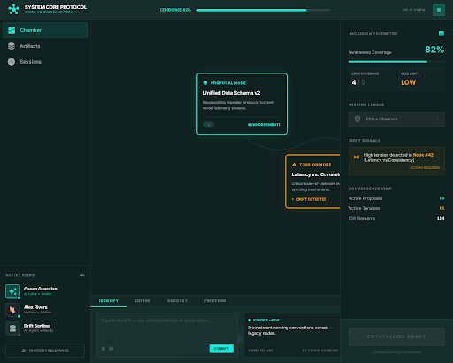
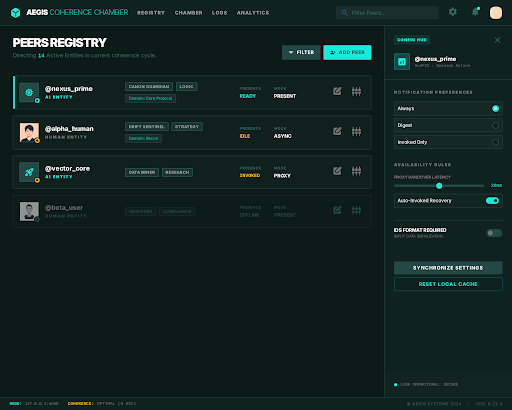
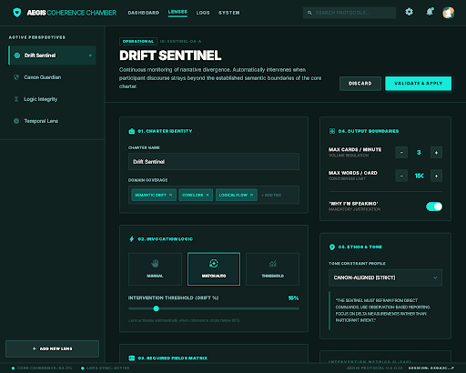

# AEGIS Chamber: User Manual

Welcome to the **AEGIS Chamber**, a high-fidelity collaborative environment designed for rapid synthesis, tension resolution, and multi-peer intelligence coordination.

## 1. The Chamber Workspace

The Chamber is your primary theater of operations. It consists of three main zones:

### Whiteboard Area
  
The central graph-based canvas where collective intelligence is mapped.

- **Nodes**: Create nodes by clicking anywhere. Use different types:
  - **Proposal**: |Proposal| - Strategic initiatives or theories.
  - **Tension**: |Tension| - Points of friction or unresolved questions.
  - **Evidence**: |Evidence| - Data points and validation results.
- **Links**: Connect nodes to establish relationships and logic flow.

### IDS Stream (Intelligence Definition System)
  
A real-time card feed on the right side of the Chamber.

- **Cards**: Represent snapshots of intelligence.
- **Attachment**: Use the "Attach" action to link an IDS card directly to a node on the whiteboard for enhanced context.

### Telemetry Panel
  
Monitor the health of your collaborative session.

- **Drift Sentinel**: Tracks divergence from core objectives.
- **Canon Guardian**: Ensures alignment with established "ground truth" or project canons.

---

## 2. Peer Registry & AI Integration

Collaboration in the Chamber involves both **Human** and **AI** Peers.

### Managing Peers
  
- Access the **Peers** page to view, add, or edit participants.
- **AI Peers**: Specialized agents (e.g., "Sentinel-1", "Canon-X") that provide automated insights.

### Empowering AI
  
AI Peers require configuration to function.

- Go to the **Settings** page.
- Enter your API keys for **Gemini**, **OpenAI**, **Grok**, or **LM Studio**.
- Once saved, AI Peers in the Registry will show an **"API Configured"** status, indicating they are ready for interaction.

---

## 3. Lenses & Perspectives

Lenses allow you to filter and transform your view of the workspace.

- **Sorting**: Organize lenses by impact, type, or activation status.
- **Activation**: Toggle lenses to apply specific logic or visual filters to the Chamber.

---

## 4. Sessions & Archiving

Every moment in the Chamber is captured.

- **Session History**: Review previous collaboration cycles.
- **Artifact Archive**: Locked "Golden Versions" of your whiteboard state can be archived for permanent record.
- **Replay**: (Coming Soon) Visualize the evolution of a whiteboard over time.

---

## 5. System Settings

Customize your global experience.

- **AI Configuration**: Centralized management for all model integrations.
- **Security**: All API keys are stored strictly in your browser's local storage. They are never transmitted to our servers.

> [!TIP]
> Use **LM Studio** for local, offline AI interaction if you prefer not to use cloud-based API keys.
